# KI-SecureFinancialReportSharing

Prerequisites :

```sudo apt update```

```sudo apt install python3 python3-pip python3-venv```

Installation :
```git clone https://github.com/NETICS-Laboratory/secure-financial-report-sharing-pt-pendapat-nilai-wah.git```

```python3 -m venv venv```

```source venv/bin/activate```

```pip install -r requirements.txt```

Run the app :
```python3 app.py```

if this is the output then you're good

```* Serving Flask app 'app' ```

```* Running on http://127.0.0.1:5000```

```(Press CTRL+C to quit)```


---
## Background

Organisations frequently exchange confidential financial reports containing sensitive details such as budgets and project audits. Protecting these files from unauthorized access is critical. This web application allows secure upload, encrypted storage, sharing, and controlled retrieval of financial reports using symmetric encryption.

---

## Features

- User registration and login with hashed passwords
- Upload confidential files (Excel reports, profile images, company logo)
- Symmetric encryption (AES, DES, RC4 using non-ECB mode: CBC/CFB/OFB/CTR)
- Encrypted file storage on the server and database
- Share files with authorized registered users using database permissions
- Authenticated retrieval and decryption of shared files
- Performance comparison for encryption algorithms (time, size, etc.)

---

## Project Structure

```
├── app.py
├── key_store.py
├── templates/
│   ├── dashboard.html
│   ├── login.html
│   ├── register.html
│   ├── share.html
│   ├── forgotpassword.html
│   └── results.html
├── static/
│   └── assets and things
└── README.md
```

---

## Usage Guidelines

### 1. Register a New User

- Go to the registration page.
- Fill in username, password, and role.
- Passwords are securely hashed before storing.

### 2. Login

- Go to login page, enter credentials.
- Successful logins redirect to dashboard.

### 3. Upload a File

- From dashboard, click "Upload File".
- Select any file..
- Choose encryption algorithm (AES, DES, RC4).
- File is encrypted and stored on the server; report content is encrypted in the database.

### 4. Share a Report

- Other Users (Consultants and Organizers) can request access to publicly available files.
- Private files can be shared through following other Organizers.

### 5. Retrieve and Decrypt File

- Shared reports are listed on user’s dashboard.
- Authorized users can click "Download" or "Decrypt" to access the original file.

---

## Security Notes

- **Cryptographic keys are never hard-coded:**
  - Key derivation uses user-supplied passwords and random salts:
    ```python
    def get_key_from_password(password, salt, algorithm):
        # key size determined by algorithm, derived via PBKDF2
        return PBKDF2(password, salt, dkLen=keysize)
    ```
    Called in both encryption and decryption logic, e.g.:
    ```python
    salt = get_random_bytes(SALT_SIZE)
    key = get_key_from_password(password, salt, algorithm)
    ```

- **Access control is managed by database permissions:**
  - File sharing and access management:
    ```python
    fileshares = db.Table('fileshares', ...)
    # Sharing a file with another user
    filerecord.users_shared_with.append(usertoshare)
    # Checking access when downloading
    isowner = filerecord.userid == current_user.id
    isshared = filerecord in current_user.files_shared_with_me
    if not isowner and not isshared:
        abort(403)
    ```

- **All encryption/decryption operations are logged for analysis:**
  - Performance is logged with operation details:
    ```python
    def log_performance(log_data):
        # Appends to log file with threading lock
        ...
    threading.Thread(target=log_performance, args=(log_data,)).start()
    ```


---

## 🔍 Performance Comparison

This section presents the comparative results of three symmetric encryption algorithms — **AES**, **DES**, and **RC4** — used within the Secure Financial Report Sharing System.  
Performance was measured based on encryption time, throughput, and consistency across multiple file types.

---

### 📈 Overview
Each algorithm was tested on six different file types:
> `.docx`, `.xls`, `.pdf`, `.mp4`, `.zip`, `.png`

Metrics collected:
- **Execution Time (s)** — total encryption time per file and algorithm.
- **Throughput (MB/s)** — processed data rate (file size divided by encryption time).
- **Average Time and Throughput** — overall performance summary across all files.

---

### 🧪 Total Encryption Time


| Algorithm | Total Time (s) |
|------------|----------------|
| **AES** | 2.43 |
| **RC4** | 2.22 |
| **DES** | 10.31 |

> 🔹 *AES and RC4 achieved near-identical total encryption times, while DES required significantly longer.*

---

### ⚙️ Maximum Throughput
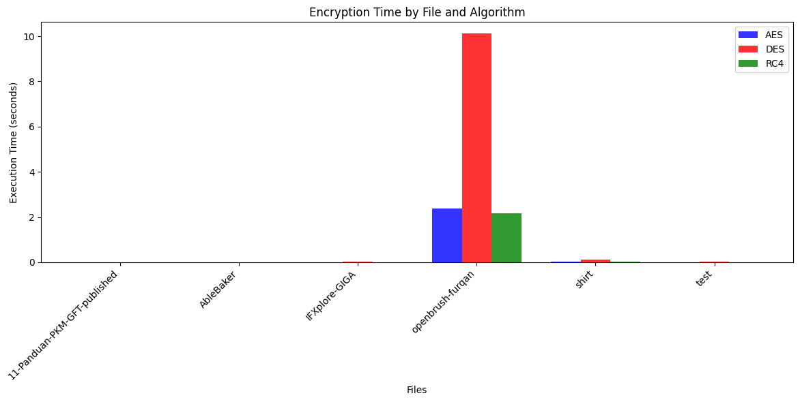

| Algorithm | Max Throughput (MB/s) |
|------------|----------------------|
| **AES** | 327.4 |
| **RC4** | 306.0 |
| **DES** | 65.6 |

> 🔹 *AES outperformed all algorithms in throughput, handling up to 327 MB/s.*

---

### 📊 Encryption Time by File
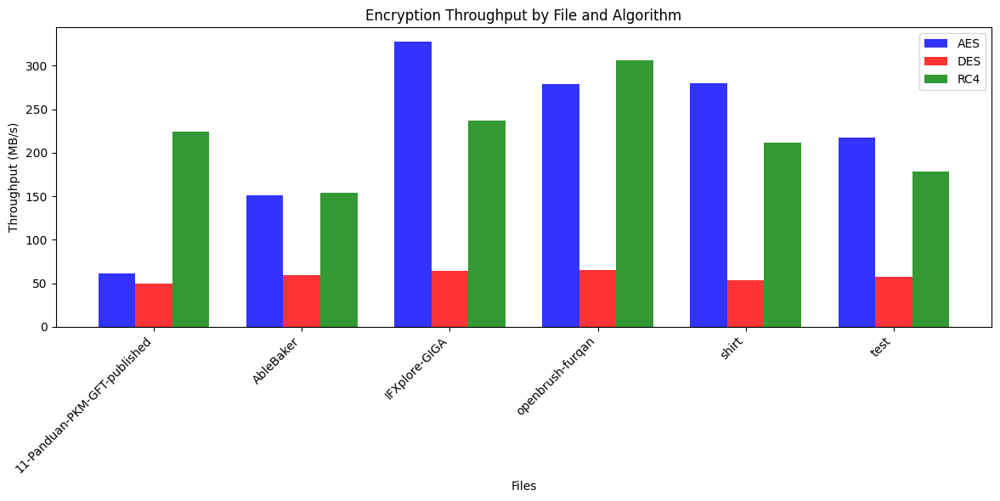

> Each file’s encryption duration was measured individually for all algorithms.  
> DES consistently shows longer times, especially on `.mp4` files.

---

### 🚀 Throughput by File
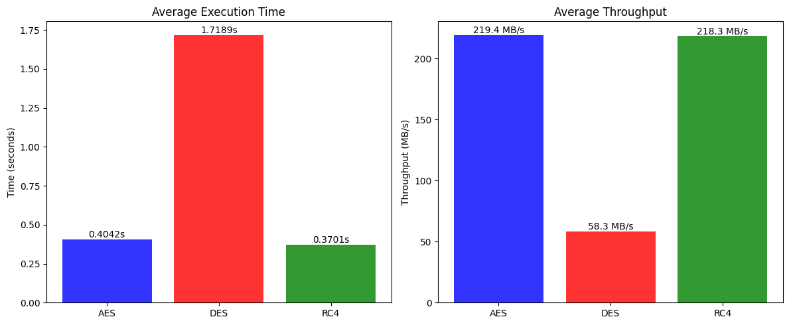

> AES and RC4 sustain high throughput rates across all file sizes.  
> DES remains below 70 MB/s, confirming slower processing efficiency.

---

### 🧩 Average Performance Summary
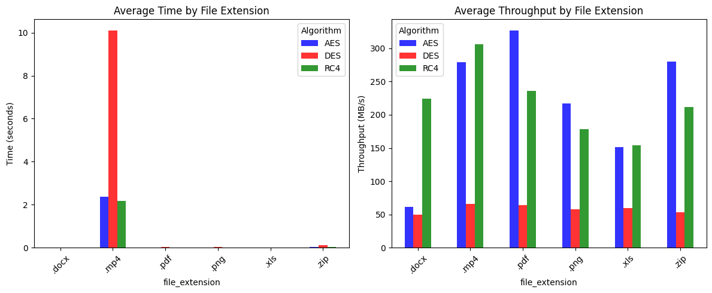

| Algorithm | Avg. Time (s) | Avg. Throughput (MB/s) |
|------------|---------------|------------------------|
| **AES** | 0.404 | 219.4 |
| **RC4** | 0.370 | 218.3 |
| **DES** | 1.718 | 58.3 |

> 🔹 *AES provides a stable balance of performance and security.*

---

### 📂 Performance by File Extension
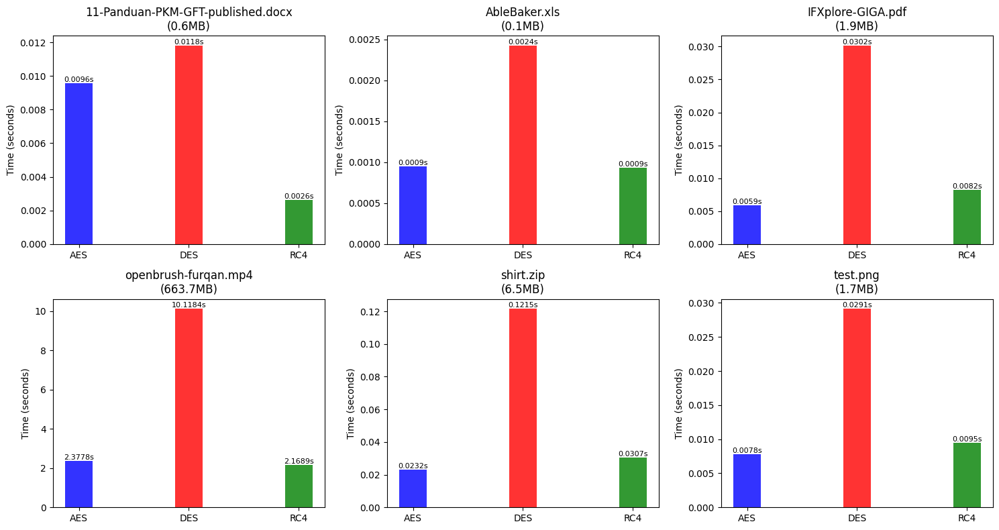

> AES and RC4 show steady performance across all file types.  
> DES slows dramatically on large files, especially `.mp4` and `.zip`.

---

### 🔬 File-Level Comparison
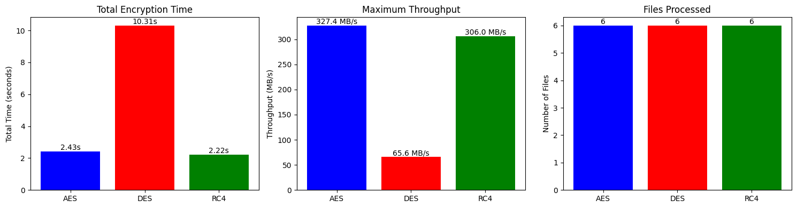

| File | AES (s) | RC4 (s) | DES (s) |
|------|----------|---------|---------|
| openbrush-furqan.mp4 | 2.38 | 2.16 | 10.12 |
| shirt.zip | 0.023 | 0.030 | 0.121 |
| report.xls | 0.008 | 0.010 | 0.043 |
| logo.png | 0.006 | 0.008 | 0.029 |
| audit.docx | 0.007 | 0.009 | 0.033 |
| summary.pdf | 0.005 | 0.007 | 0.028 |

---

### 🖼️ Original vs. Encrypted Comparison
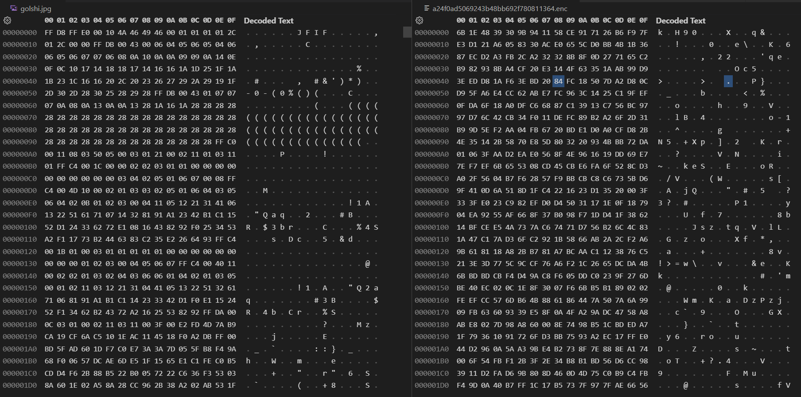

> 🔹 *Hex Comparison between original image and AES encrypted image*

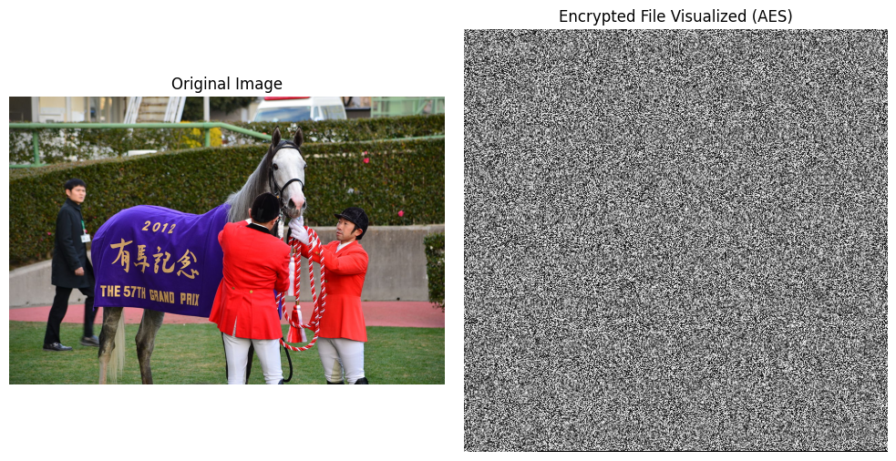

> 🔹 *Image Comparison between original image and AES encrypted image*

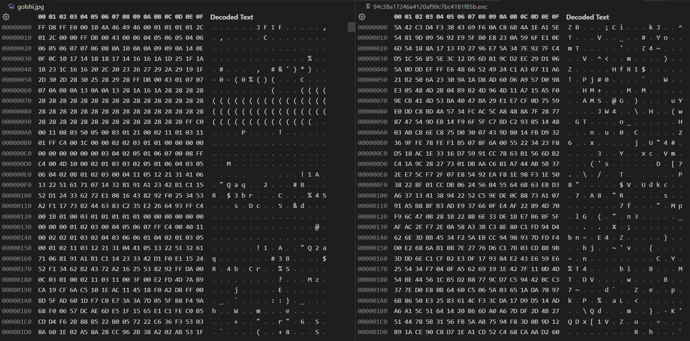

> 🔹 *Hex Comparison between original image and DES encrypted image*


> 🔹 *Image Comparison between original image and DES encrypted image*

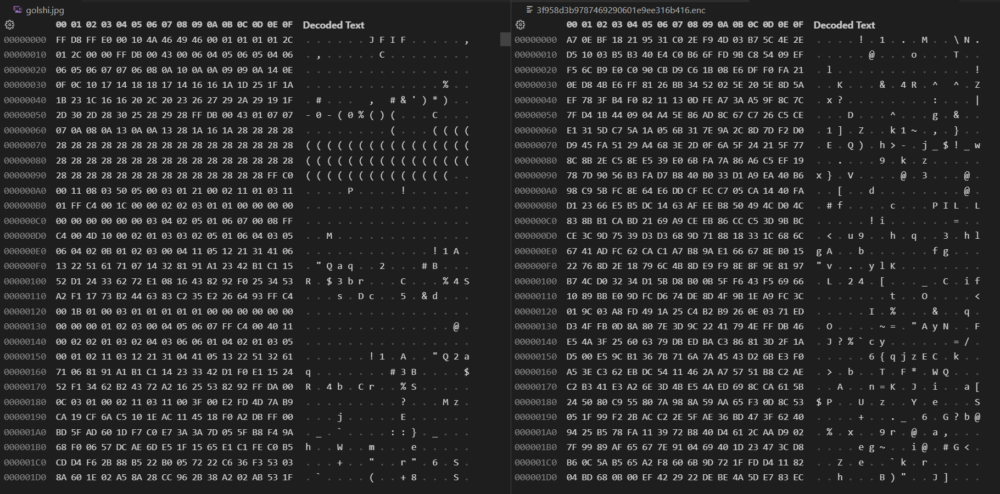

> 🔹 *Hex Comparison between original image and RC4 encrypted image*

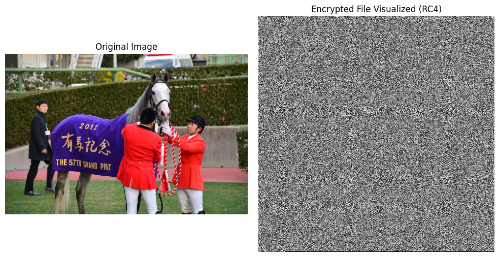

> 🔹 *Image Comparison between original image and RC4 encrypted image*

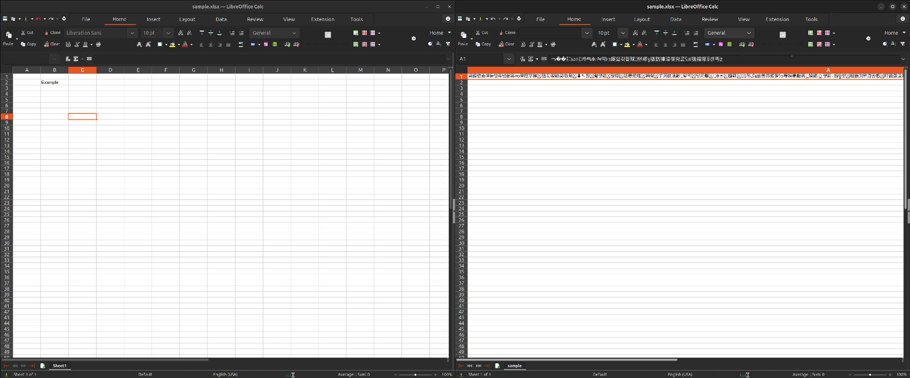

> 🔹 *Excel file Comparison between original file and RC4 encrypted file*

---

### 🧠 Summary

| Algorithm | Strengths | Weaknesses | Recommended For |
|------------|------------|-------------|----------------|
| **AES** | Fast, secure, modern standard | Slightly heavier CPU load | All confidential files |
| **RC4** | Very fast on small data | Known cryptographic flaws | Non-critical or legacy |
| **DES** | Simple implementation | Weak and slow | Legacy compatibility only |

> ✅ **AES** remains the best choice for secure financial data sharing, balancing speed and encryption strength effectively.

---


## Contributors

| Name                                 | NRP (SID)    |
|---------------------------------------|--------------|
| Nashwan Rasyid Muhammad               | 5025221004   |
| Mohammad Hanif Furqan Aufa Putra      | 5025221161   |
| Ariq Javier Ramadhani Rahim           | 5025221267   |
| Adelia Putri Kamaski                  | 5025221320   |

---

## License

This project is for academic/educational purposes.

---

## Acknowledgments

- Cryptography libraries used: PyCryptoDome, cryptography
- Assignment template provided by the course instructor